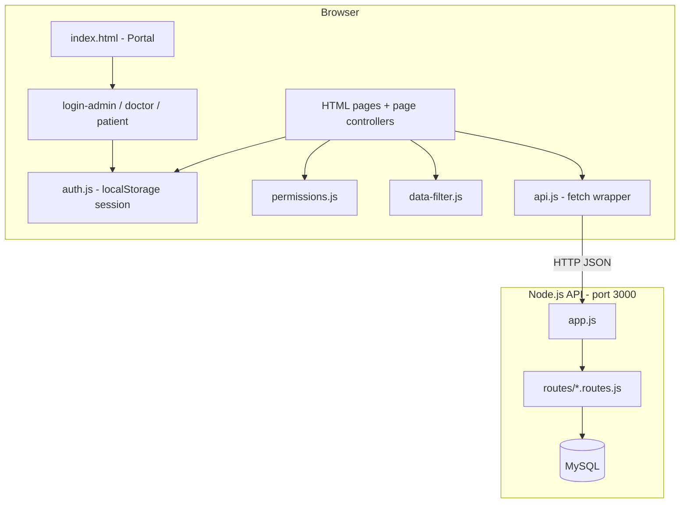

# Nambikkai Healthcare

A small **Hospital Information Management System (HIMS)** built as a **learning project**. It models how a real hospital might split work across three roles — nurse desk, doctors, and patients — using a REST API backend and a plain HTML/JavaScript frontend.

The goal is not production readiness. The goal is to practice **full-stack design**: relational data, REST endpoints, role-based UI, and clear separation between API, services, and page logic — without hiding everything inside a framework.

---

## What you can learn here

| Topic | Where it lives |
|-------|----------------|
| Express routing & middleware | `src/app.js`, `src/routes/*.routes.js` |
| MySQL connection pooling & SQL joins | `src/config/db.js`, route queries |
| REST CRUD patterns | All `/api/*` routes |
| Fetch API & service layer | `frontend/js/api.js` |
| Demo auth & session storage | `frontend/js/auth.js`, `login-*.js` |
| Role permissions (single source of truth) | `frontend/js/permissions.js` |
| Client-side data scoping by role | `frontend/js/data-filter.js` |
| Page controllers (one file per screen) | `frontend/js/pages/*-controller.js` |
| Shared layout & navigation | `frontend/js/layout.js` |
| Minimal UI on Bootstrap | `frontend/css/app.css` |

---

## Tech stack

| Layer | Technology |
|-------|------------|
| Runtime | Node.js (CommonJS) |
| HTTP server | Express 5 |
| Database | MySQL via `mysql2` (connection pool) |
| Config | `dotenv` |
| CORS | `cors` (allows frontend on another origin/port) |
| Frontend | Vanilla HTML, CSS, JavaScript (ES6 classes) |
| UI | Bootstrap 5.3 + Bootstrap Icons (CDN) |
| Dev reload | `nodemon` (optional) |

No React, no build step, no bundler — intentional, so you can read every file.

---

## High-level architecture



### Request flow (example: doctor views appointments)

1. Doctor signs in on `login-doctor.html` — name + email matched against a row in `Doctors`.
2. `AuthService` stores `{ role: 'doctor', userId: doctor_id, profile }` in `localStorage`.
3. `appointments-controller.js` calls `ApiService.getAppointments()`.
4. Backend returns **all** appointments (with patient/doctor names via SQL `JOIN`).
5. `DataFilter.scope()` keeps only rows where `doctor_id` matches the logged-in doctor.
6. `Permissions` controls which buttons (view / edit / delete) appear.

> **Important:** Authorization is enforced in the **frontend only**. The API has no JWT or session checks. This is fine for learning; it is **not** safe for production.

---

## Roles & capabilities

The UI label **Nurse** maps to the code role `admin`.

| Role | Login | Identity check | Can do |
|------|-------|----------------|--------|
| **Nurse** (`admin`) | `admin` / `admin123` | Fixed demo credentials | Register patients, manage doctors, schedule appointments, view all records & orders |
| **Doctor** | Select name + matching email from DB | Row in `Doctors` | View own schedule, write diagnoses (records), place clinical orders |
| **Patient** | Select name + matching date of birth | Row in `Patients` | **Read-only** — profile, appointments, doctors, records |

Patients cannot book appointments in the app; copy in the UI directs them to the nurse desk — mirroring a real front-desk workflow.

---

## Project structure

```
nambikkaihealthcare/
├── server.js                 # Entry point — verifies DB, starts HTTP server
├── package.json
├── .env.example              # Copy to .env (never commit .env)
│
├── src/
│   ├── app.js                # Express app, middleware, route mounting
│   ├── config/
│   │   └── db.js             # MySQL connection pool
│   └── routes/
│       ├── patients.routes.js
│       ├── doctors.routes.js
│       ├── appointments.routes.js
│       ├── records.routes.js
│       └── orders.routes.js
│
└── frontend/
    ├── css/
    │   └── app.css           # Thin theme on top of Bootstrap
    ├── html/                 # One HTML file per screen
    │   ├── index.html        # Portal — pick a role
    │   ├── login-*.html
    │   ├── dashboard.html
    │   ├── patients.html
    │   ├── doctors.html
    │   ├── appointments.html
    │   ├── medical-records.html
    │   ├── clinical-orders.html
    │   └── profile.html      # Patient only
    └── js/
        ├── api.js            # All backend calls
        ├── auth.js           # Session in localStorage
        ├── permissions.js    # Role capabilities
        ├── data-filter.js    # Scope lists to current user
        ├── layout.js         # Nav, headers, guards
        ├── utils.js          # Dates, toasts, modals
        ├── login*.js         # Per-role login logic
        └── pages/
            └── *-controller.js   # Page-specific logic
```

---

## Database model

Expected MySQL tables (names match the route queries):

| Table | Purpose | Key relationships |
|-------|---------|-------------------|
| `Patients` | Demographics | Referenced by appointments, records, orders |
| `Doctors` | Staff profiles | Referenced by appointments, records, orders |
| `Appointments` | Scheduled visits | `patient_id`, `doctor_id` |
| `Medical_Records` | Visit notes & diagnosis | `patient_id`, `doctor_id` |
| `Clinical_Orders` | Labs, imaging, prescriptions | `patient_id`, `doctor_id` |

List endpoints for appointments, records, and orders use `JOIN` to return human-readable `patient_name` and `doctor_name`, plus `patient_id` / `doctor_id` for frontend filtering.

You need an existing schema and seed data in your MySQL instance (database name typically `hims_db`). This repo does not ship a migration script — set up the database separately or reuse a course/lab database.

---

## API reference

Base URL: `http://localhost:3000/api`

| Resource | Base path | Methods |
|----------|-----------|---------|
| Patients | `/patients` | GET, GET `/:id`, POST, PUT `/:id`, DELETE `/:id` |
| Doctors | `/doctors` | GET, GET `/:id`, POST, PUT `/:id`, DELETE `/:id` |
| Appointments | `/appointments` | GET, GET `/:id`, POST, PUT `/:id`, DELETE `/:id` |
| Medical records | `/records` | GET, GET `/:id`, POST, PUT `/:id`, DELETE `/:id` |
| Clinical orders | `/orders` | GET, GET `/:id`, POST, PUT `/:id`, DELETE `/:id` |

Health check (no `/api` prefix): `GET /health`

### Response shape

```json
{
  "success": true,
  "count": 10,
  "data": [ /* ... */ ]
}
```

Errors return `{ "success": false, "message": "..." }` with an appropriate HTTP status.

---

## Getting started

### Prerequisites

- Node.js 18+ recommended
- MySQL 8+ (local or cloud — e.g. Aiven, RDS, Docker)
- A static file server for the frontend (or VS Code Live Server)

### 1. Clone and install

```bash
git clone <your-repo-url>
cd nambikkaihealthcare
npm install
```

### 2. Configure environment

```bash
cp .env.example .env
```

Edit `.env` with your database host, user, password, database name, and port.

### 3. Start the API

```bash
npm start
# or for auto-restart on file changes:
npm run dev
```

You should see:

```
✅ MySQL database connected successfully
🚀 Server running on http://localhost:3000
```

Confirm: open `http://localhost:3000/health` in a browser.

### 4. Serve the frontend

The frontend calls `http://localhost:3000/api` (see `frontend/js/api.js`). Serve `frontend/html` over HTTP — **not** `file://`, or fetch may fail.

**Option A — VS Code Live Server**

Open `frontend/html/index.html` → “Open with Live Server” (usually port 5500).

**Option B — `npx serve`**

```bash
npx serve frontend/html -p 5500
```

Then open `http://localhost:5500/index.html`.

### 5. Try the three portals

| Portal | URL | How to sign in |
|--------|-----|----------------|
| Nurse | `login-admin.html` | Username `admin`, password `admin123` |
| Doctor | `login-doctor.html` | Pick a doctor; enter the **same email** stored in `Doctors` |
| Patient | `login-patient.html` | Pick a patient; enter the **same date of birth** as in `Patients` |

Start with the **Nurse** portal to register patients and doctors if your database is empty.

---

## Frontend design

### Layered JavaScript

Each authenticated HTML page loads scripts in this order:

```
Bootstrap → api.js → auth.js → utils.js → permissions.js → layout.js
         → [data-filter.js] → pages/*-controller.js
```

- **`layout.js`** — `Layout.init('pageId')` checks login, role, and page access; builds nav and page title.
- **`permissions.js`** — `canScheduleAppointments()`, `rowActions()`, `allowedPages`, etc.
- **Page controllers** — One class per screen; binds forms, loads data, renders tables.

### UI conventions

- Centered content column (`app-shell`, max-width 1040px)
- Bootstrap for layout/components; `app.css` for hospital colors and compact tables
- Modals and toasts via `UIUtils`

### Adding a new page

1. Copy an existing page HTML shell (navbar + banner + `app-shell`).
2. Create `frontend/js/pages/your-feature-controller.js`.
3. Register the page id in `permissions.js` → `allowedPages`.
4. Add nav entry in `layout.js` → `NAV` and optional `PAGE` metadata.
5. Add API methods in `api.js` and a route file under `src/routes/` if needed.

---

## Backend design

### `server.js`

Fails fast: runs `SELECT 1` before listening. If MySQL is down, the process exits with a clear error.

### `src/app.js`

- `express.json()` for JSON bodies
- `cors()` for cross-origin frontend
- Mounts five routers under `/api/*`
- 404 handler + global error handler

### Route files

Each file follows the same pattern:

- `GET /` — list (often with joins)
- `GET /:id` — single row
- `POST /` — create with validation
- `PUT /:id` — update
- `DELETE /:id` — delete

Parameterized queries (`?` placeholders) are used to reduce SQL injection risk.

---

## Suggested learning exercises

1. **Add server-side auth** — JWT middleware that checks role on mutating routes.
2. **Add a `Users` table** — replace demo nurse login with hashed passwords.
3. **Patient booking** — allow patients to request appointments (pending nurse approval).
4. **Pagination** — `GET /api/patients?page=1&limit=20`.
5. **Audit log** — who created/updated each record.
6. **Replace vanilla JS** — rebuild one module in React/Vue and compare complexity.

---

## Maintenance notes

| Task | Location |
|------|----------|
| Change API port | `.env` → `PORT`; update `API_BASE_URL` in `frontend/js/api.js` |
| Change nurse demo password | `frontend/js/login-admin.js` → `DEMO_ADMIN` |
| Adjust role permissions | `frontend/js/permissions.js` |
| Adjust nav / page titles | `frontend/js/layout.js` |
| Theme / spacing | `frontend/css/app.css` |
| New REST resource | `src/routes/new.routes.js` + mount in `src/app.js` + `api.js` |

### Common issues

| Problem | Likely cause |
|---------|----------------|
| API shows “Offline” in footer | Backend not running, or wrong port |
| `Failed to connect to database` | Wrong `.env` values or MySQL not reachable |
| Doctor/patient login fails | Email/DOB does not match the selected row |
| CORS / network errors | Frontend opened as `file://` — use a local HTTP server |
| Patient DOB mismatch | Use local date formatting — handled by `UIUtils.toInputDate()` |

---

## Security disclaimer

This project uses **demo authentication**:

- Nurse: hard-coded username/password in JavaScript
- Doctor/Patient: identity checked in the browser against public API data
- API endpoints are **unauthenticated**

Do not deploy this stack with real patient data. Treat it as a **sandbox for learning** only.

---

## Scripts

| Command | Description |
|---------|-------------|
| `npm start` | Start API (`node server.js`) |
| `npm run dev` | Start API with nodemon |

---

## License

ISC — learning and experimentation.

---

**Happy learning.** Start at the portal (`frontend/html/index.html`), sign in as nurse, register a patient, schedule an appointment, then sign in as that patient and doctor to see how the same data looks through different roles.